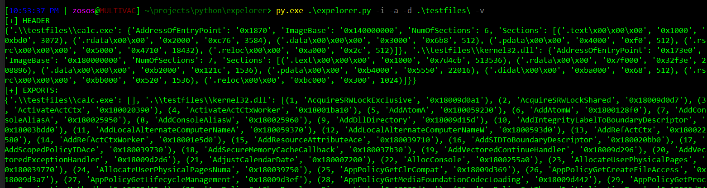

# expelorer.py
## PE export explorer

### Info:
tool to investigate export directory in PE files. Takes in a directory (folder path) as input and parses the exports of all PE files inside it.
Inspired by automating assignment1 from the Sektor7 intermediate malware dev course (Which I highly recommend).
- supports DLLs and EXEs
- outputs to console or file
- no recursive directory logic yet (but soon!)

### Usage:
```expelorer.py -d "C:\\Windows\\System32" -v -o results.txt```

#### Arguments:
- **-d**: directory of PE files to pull exports from
- **-v**: print status to console
- **-o**: dump exports info to file 

### Dependencies
- argparse
- pefile
to install dependencies copy the following
```
pip3 install argparse
pip3 install pefile
```


#### Ex:



To see a sample of the file output feature, check out system32_results.txt

### Source(s):
- sektor7 intermediate malware dev course
- pefile github (https://github.com/erocarrera/pefile)
